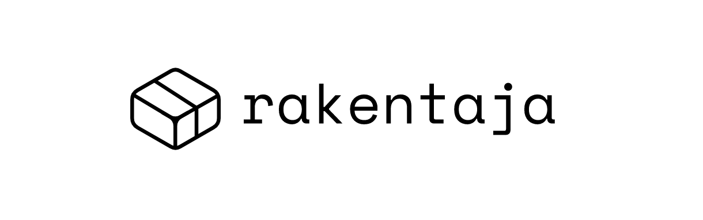

<center></center>

## Motivation
Are you sick of configuring your projects from scratch over and over again ? 

Are you a library author ?

Do you experiment much ?

This is the tool you need.

## Installation

Install globally with `npm i -g @rakentaja/cli` or  `yarn global add @rakentaja/cli`

## Configuration

Add a `rakentaja.json` to the root of your tempaltes folder having the structure : 

```
{
  "commands": [],
  "keys": {
    "key": "value"
  }
}

```

`commands:` => An array of commands to run after your project is created
`keys`: => Default values for keys in your template files
## Usage


```
rakentaja <source> [target]

Create a project from template

Options:
  --version  Show version number                                       [boolean]
  --help     Show help                                                 [boolean]
```

Pass the template directory : 
```
rakentaja myTemplateFolder ./MyProject
```

# Roadmap
- Support `.zip` packages for templates
- Add git support


## Known Issues

**!!! Git support is not working yet!**

## Contribution

## Credits

## LICENCE


